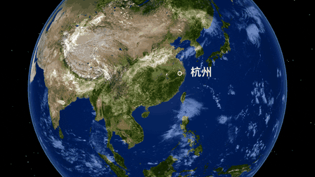

<p align="right">
  <a href="./README.md">简体中文</a> | English
</p>

## Installation

```bash
npx skills add vibe-motion/skills
```

> Note: This is an interactive installer. Use `Space` to select skills (installing all is recommended), and make sure to choose the target agent (for example, Claude Code), since different agents use different skill directories.

## Available Skills

### ruler-progress-render

Creates a ruler progress animation. Trigger keyword: 尺子进度动画; supports configurable parameters such as text and progress.


### claude-typer

Converts prompt text into a Claude Code CLI typing animation demo.


### procedural-fish-render

Generates a loop-friendly procedural fish animation.


### svg-assembly-animator

Delivers a strong "power + speed" assembly look from static vectors.

<table>
  <tr>
    <td align="center"><strong>SVG</strong></td>
    <td align="center"><strong>GIF</strong></td>
  </tr>
  <tr>
    <td></td>
    <td></td>
  </tr>
</table>

### pixel2motion

Turns PNG/JPG/WebP/screenshot logos into clean, low-complexity, motion-ready SVG, then generates branded logo motion, interactive HTML demos, GIF/video previews, and motion QA evidence. Useful for logo animation, SVG logo reveal, brand motion delivery, and pixel-to-vector-to-motion workflows.


### light-spotlight-render

Generates a swinging spotlight text-reveal HTML animation with configurable text, swing range, lamp scale, glow, and background color.


### remotion-3d-ticker

Creates an infinite 3D vertical scrolling photo wall/ticker animation in Remotion. Configurable image columns, scroll direction, and speed.


### remotion-vinyl-player

Creates an elegant, realistic Vinyl Record Player animation in Remotion. Features infinite record rotation, seamless marquee text scrolling for long titles, and customizable album art.


### threejs-earth-render

Clones or updates `vibe-motion/threejs-earth` and renders a Three.js 3D Earth route animation with Puppeteer. Useful for globe flight arcs, city-to-city transitions, and 16:9 Earth GIF/MP4 exports.



### wechat-2d-render

Clones or updates `sxhzju/wechat-2d` and renders the default WeChat-style 2D chat motion video. Useful for WeChat chat animation, video-message bubble motion, and transparent Remotion exports.


### disney-animation-rule-skill

Applies Disney's 12 animation principles as practical design and engineering rules for procedural animation. Use when creating, improving, reviewing, or debugging code-driven motion in web, SVG, canvas, React, Remotion, game, UI, character, camera, or 3D scenes — especially when motion feels stiff, weightless, mechanical, unclear, or physically correct but visually weak.

## Misc

### Fish School Simulation

A Three.js boids fish school simulation project. This is a standalone project, not a skill.

Project: [vibe-motion/threejs-boids](https://github.com/vibe-motion/threejs-boids)


## Community Group

The WeChat group has reached 200 members and can no longer be joined via QR code. Please add my WeChat and I'll manually invite you to the group.

TG group: t.me/zjucat

<p align="center">
  
</p>

## Star History

[](https://www.star-history.com/#vibe-motion/skills&Date)
