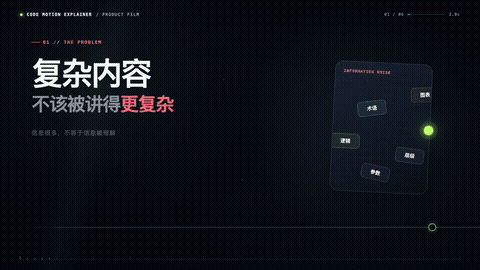
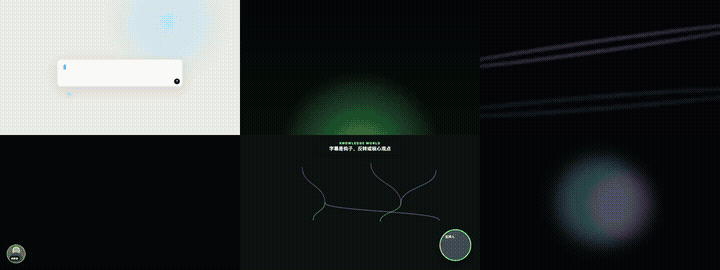
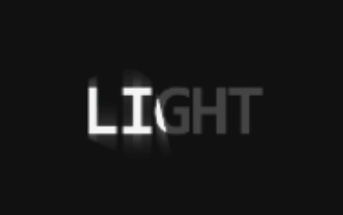
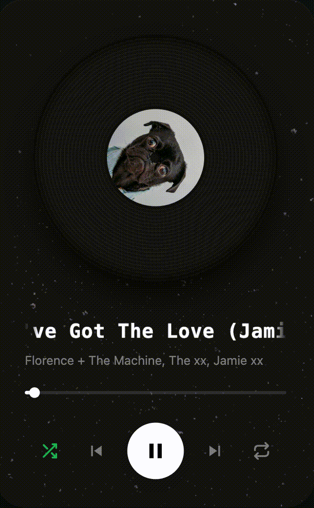
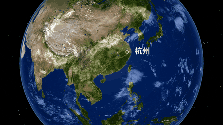
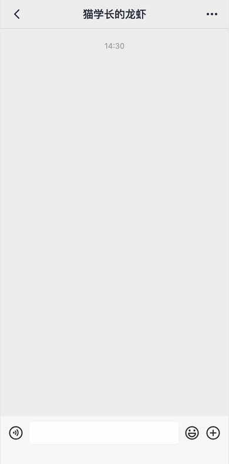

<p align="right">
  <a href="./README.md">简体中文</a> | English
</p>

## Installation

```bash
npx skills add vibe-motion/skills
```

> Note: This is an interactive installer. Use `Space` to select skills (installing all is recommended), and make sure to choose the target agent (for example, Claude Code), since different agents use different skill directories.

## Available Skills

### remotion-code-motion-explainer

Turn scripts, narration, subtitles, product flows, technical principles, or reference videos into
continuous, editable, parameterized Remotion motion graphics. It is designed for product launches,
AI workflows, UI interactions, algorithms, scientific principles, data flows, architecture,
charts, equations, and electrical systems. The Skill includes semantic shot planning, persistent
spatial logic, a searchable shot library, high-fidelity reconstruction guidance, audio binding,
and frame-level visual QA.

[](remotion-code-motion-explainer/assets/showcase/code-motion-promo-30s.mp4)

Capability example: [220V AC to 15V DC explainer](remotion-code-motion-explainer/assets/showcase/ac-to-dc-explainer.mp4)

[](remotion-code-motion-explainer/assets/showcase/code-motion-shot-library-preview.mp4)

The bundled library contains 63 searchable entries and 65 Remotion compositions. The motion wall
shows Prompt → Agent, an AI product grid, a glass dashboard, an exploded workflow, an SRT knowledge
world, and a neon message path. Every shot keeps its source and Props for brand, copy, data, aspect
ratio, and timing adaptations.

#### Key advantages

- **Understand before animating**: compile content into input state → action → system response →
  visible result → handoff, so every movement performs an explanatory job.
- **Continuous spatial storytelling**: keep important objects alive across shots and mutate their
  state instead of resetting the whole screen like a slide deck.
- **Fully editable**: copy, data, brand, timing, waveforms, paths, camera, and aspect ratio remain
  controlled by React Props and the Remotion timeline.
- **Shot-library first**: search by semantic intent before reusing, adapting, or creating a system.
  Reuse component logic rather than inserting an old MP4.
- **High-fidelity reconstruction**: measure phases, geometry anchors, topology, camera motion, and
  rhythm peaks from authorized UI recordings, reference videos, or AE renders.
- **Deterministic rendering**: each frame is derived from `frame + fps + props + seeded data`,
  enabling local repairs, automation, and pixel comparisons.
- **Evidence-backed QA**: verify semantics, causality, subtitle sync, safe areas, values and
  waveforms, final holds, asset licensing, and privacy.

#### How it works

```text
Script / SRT / product specification / principle / reference
                              ↓
        Semantic compilation: objects, actions, numbers, states
                              ↓
       Director storyboard + persistent objects + shot search
                              ↓
             Hook / complex mechanism / ending hero frames
                              ↓
        React + Remotion + SVG / Canvas / WebGL / Three.js
                              ↓
             Narration, captions, labels, and audio cues
                              ↓
        Representative frames + motion windows + contact sheet
                              ↓
             Final video + editable project + reusable shots
```

#### Compared with templates and text-to-video

| Dimension | Template / text-to-video | Code Motion Explainer |
| --- | --- | --- |
| Understanding | Keyword matching or style imitation | Semantic states, actions, and causality |
| Shot structure | Independent clip assembly | Persistent objects and spatial handoffs |
| Editability | Limited downstream changes | Source, Props, data, and timeline stay editable |
| Technical ideas | Intermediate steps are often skipped | Input, transformation, and output stay visible |
| Reconstruction | Approximate visual similarity | Measured geometry, topology, phases, and rhythm |
| Stability | Regeneration may change the result | Frame-deterministic rendering |
| Reuse | Repeat a finished template | Accumulate parameterized components and evidence |
| Delivery | Usually a video | Video, project, parameters, shots, and QA evidence |

```text
Use $remotion-code-motion-explainer to turn this product explanation into a continuous 16:9
code-motion video. Make every action produce a visible result, preserve editable parameters,
and deliver a contact sheet with QC evidence.
```

### ruler-progress-render

Creates a ruler progress animation. Trigger keyword: 尺子进度动画; supports configurable parameters such as text and progress.


### claude-typer

Converts prompt text into a Claude Code CLI typing animation demo.


### procedural-fish-render

Generates a loop-friendly procedural fish animation.


### svg-assembly-animator

Delivers a strong "power + speed" assembly look from static vectors.

<table>
  <tr>
    <td align="center"><strong>SVG</strong></td>
    <td align="center"><strong>GIF</strong></td>
  </tr>
  <tr>
    <td></td>
    <td></td>
  </tr>
</table>

### light-spotlight-render

Generates a swinging spotlight text-reveal HTML animation with configurable text, swing range, lamp scale, glow, and background color.



### remotion-3d-ticker

Creates an infinite 3D vertical scrolling photo wall/ticker animation in Remotion. Configurable image columns, scroll direction, and speed.


### remotion-vinyl-player

Creates an elegant, realistic Vinyl Record Player animation in Remotion. Features infinite record rotation, seamless marquee text scrolling for long titles, and customizable album art.



### threejs-earth-render

Clones or updates `vibe-motion/threejs-earth` and renders a Three.js 3D Earth route animation with Puppeteer. Useful for globe flight arcs, city-to-city transitions, and 16:9 Earth GIF/MP4 exports.



### wechat-2d-render

Clones or updates `sxhzju/wechat-2d` and renders the default WeChat-style 2D chat motion video. Useful for WeChat chat animation, video-message bubble motion, and transparent Remotion exports.



## Misc

### Fish School Simulation

A Three.js boids fish school simulation project. This is a standalone project, not a skill.

Project: [vibe-motion/threejs-boids](https://github.com/vibe-motion/threejs-boids)


## Community Group

Scan the QR code to join the community group for updates, usage discussion, and feedback.

<p align="center">
  
</p>

## Star History

[](https://www.star-history.com/#vibe-motion/skills&Date)
