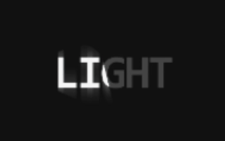

<p align="right">
  简体中文 | <a href="./README.en.md">English</a>
</p>

## 安装

```bash
npx skills add vibe-motion/skills
```

> 提示：这是一个交互式安装脚本。用空格选择要安装的 skills，建议全部安装；另外别忘了选择对应的智能体（例如 Claude Code），不同智能体的 skill 存放路径不同。

## 可用技能

### ruler-progress-render

生成尺子进度动画。触发关键词：尺子进度动画；可配置文字和进度等参数。


### claude-typer

把提示词文本转换为 Claude Code CLI 风格的打字动画演示。


### procedural-fish-render

生成循环游动的 procedural fish 动画。


### svg-assembly-animator

将静态矢量图转化为“力量感 + 速度感”明显的组装动效。

<table>
  <tr>
    <td align="center"><strong>SVG</strong></td>
    <td align="center"><strong>GIF</strong></td>
  </tr>
  <tr>
    <td></td>
    <td></td>
  </tr>
</table>

### light-spotlight-render

生成摆动聚光灯扫过文字的 reveal 动画 HTML，可配置文本、摆幅、灯罩缩放、辉光和背景颜色。



### remotion-3d-ticker

生成基于 Remotion 的无限循环 3D 照片滚动墙/瀑布流动画。可自由配置图片列、滚动方向与速度。


## Star History

[](https://www.star-history.com/#vibe-motion/skills&Date)

## 交流群

扫码加入交流群，获取更新通知、使用交流与问题反馈。

<p align="center">
  
</p>
